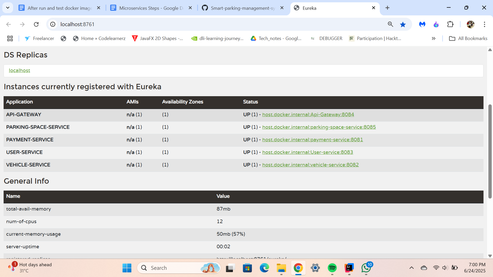

# Parking Service

## Overview
The Parking Service is a Spring Boot microservice that provides RESTful APIs for managing parking spots in the Smart Parking Management System. It is registered with the Eureka server for service discovery and can be easily integrated with other system components.

## Features
- Register, update, and delete parking spaces
- Query available parking spots
- Integration with Eureka for service discovery
- Easy-to-use RESTful API endpoints

## API Documentation
A ready-to-use Postman collection is provided for testing and exploring the APIs:

- [Smart Parking System Postman Collection](Smart-Parking-System.postman_collection.json)


  


## Getting Started

### Prerequisites
- Java 17+
- Maven
- Eureka Server running

### Running the Application

1. **Start the Eureka Server**  
   Make sure your Eureka server is running and accessible.

2. **Build and Run the Parking Service**
   ```sh
   mvn clean install
   mvn spring-boot:run